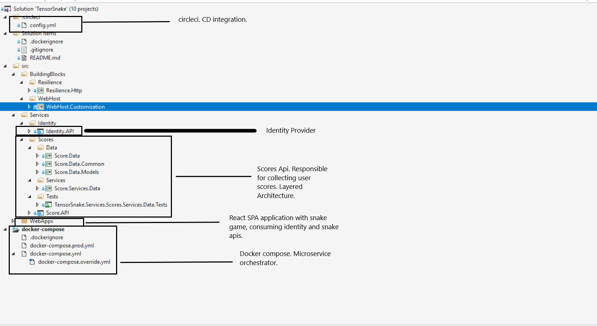

# Tensor Snake
Simple Snake Game With a Fancy Name. !important My hosting infrastructure is free so I am sleeping at the most of the time, so please be patient with me.

# Tools
>**IDE:** Visual Studio Community - https://www.visualstudio.com/vs/community/

>**Language:** C# .net Core

>**Language:** JavaScript React

>**CDI:** http://circleci.com

>**Development tasks tracking:** https://www.meistertask.com/

>**Hosting:** http://heroku.com

# Hosts infrastructure
>**WebSPA service:** http://tensor-snake-web-spa.herokuapp.com/

>**Identity Api service:** http://tensor-snake-identity-api.herokuapp.com/

>**Scores Api service:** http://tensor-snake-scores-api.herokuapp.com/

# Code Architecture

